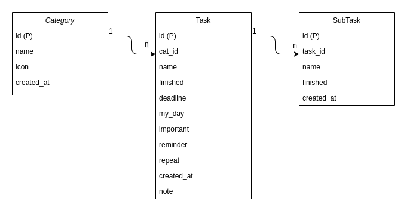

# Thiết kế database

### Database diagram

### Chi tiết thiết kế

#### Task

| Name  |  Column         |  Type   |  Nullable | Default       |   Example      |  Comments   |            
|-------|-----------------|---------|-----------|---------------|----------------|-------------|
| Tasks | id              | Int     |  false    | auto increment| Primary Key    | PRIMARY KEY |
| Tasks | cat_id          | Int     |  true     |               | Cat Id         |             |
| Tasks | name            | String  |  false    |               | Task Name      |             |
| Tasks | is_finished     | Boolean |  true     |               | Is Finished    |             |
| Tasks | date            | Date    |  true     |               | Deadline Date  |             |
| Tasks | is_myday        | Boolean |  true     |               | My Day         |             |
| Tasks | is_important    | Boolean |  true     |               | Important      |             |
| Tasks | is_reminder     | Boolean |  true     |               | Reminder       |             |
| Tasks | is_repeat       | Boolean |  true     |               | Repeat         |             |
| Tasks | created_at      | Date    |  false    |               | Created At     |             |
| Tasks | note            | String  |  true     |               | Note|          |             |

