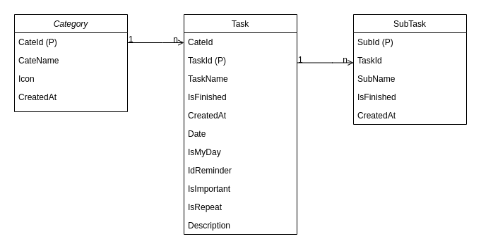

# Thiết kế database

### Database diagram

### Chi tiết thiết kế

<<<<<<< HEAD
| Name  |  Column     |  Type   |  Nullable | Default |   Example      |  Comments   |            
|-------|-------------|---------|-----------|---------|----------------|-------------|
| Tasks | CateId      | Int     |  false    |         | Cate ID        |             |
| Tasks | TaskId      | Int     |  false    |         | Primary key    | PRIMARY KEY |
| Tasks | Name        | String  |  false    |         | Task Name      |             |
| Tasks | IsFinished  | Boolean |  false    |         | Is Finished    |             |
| Tasks | Date        | String  |  false    |         | Finished Date  |             |
| Tasks | IsMyday     | Boolean |  false    |         | My Day         |             |
| Tasks | IsImportant | Boolean |  false    |         | Important      |             |
| Tasks | IsReminder  | Boolean |  false    |         | Reminder       |             |
| Tasks | IsRepeat    | Boolean |  false    |         | Repeat         |             |
| Tasks | CreatedAt   | String  |  false    |         | Created At     |             |
| Tasks | Description | String  |  false    |         | Add Description|             |
>>>>>>> Update db.md
=======
#### Task

| Name  |  Column         |  Type   |  Nullable | Default       |   Example      |  Comments   |            
|-------|-----------------|---------|-----------|---------------|----------------|-------------|
| Tasks | cate_id         | Int     |  false    |               | Cate ID        |             |
| Tasks | id              | Int     |  false    |auto increment | Primary key    | PRIMARY KEY |
| Tasks | name            | String  |  false    |               | Task Name      |             |
| Tasks | is_finished     | Boolean |      |               | Is Finished    |             |
| Tasks | date            | String  |  false    |               | Finished Date  |             |
| Tasks | is_myday        | Boolean |  false    |               | My Day         |             |
| Tasks | is_important    | Boolean |  false    |               | Important      |             |
| Tasks | is_reminder     | Boolean |  false    |               | Reminder       |             |
| Tasks | is_repeat       | Boolean |  false    |               | Repeat         |             |
| Tasks | created_at      | String  |  false    |               | Created At     |             |
| Tasks | add_description | String  |  false    |               | Add Description|             |
>>>>>>> Update db.md
