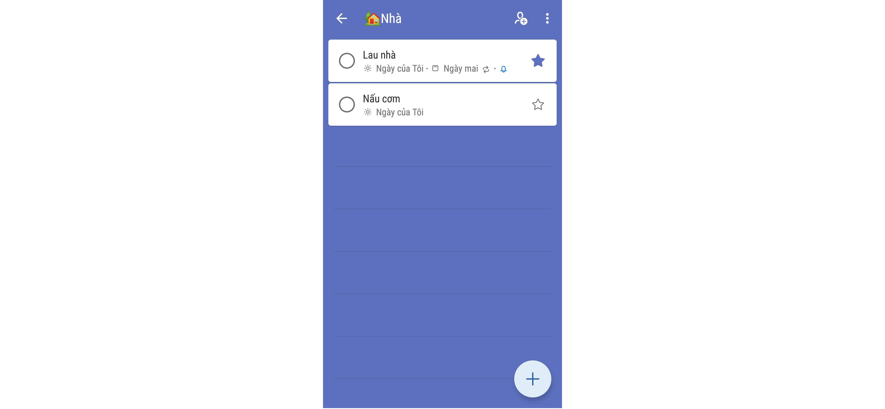

# Danh sách nhiệm vụ
# Ví dụ chi tiết thiết kế

| # | Thành phần | Loại | Chức năng | Dữ liệu |
| ---- | ---------- | ------------------- | --------- | --------- |
| 1 | Nút back| Button | Trở lại màn hình home Icon:  |  |
| 2 | Icon của Category | ImageView | Hiển thị icon của Category Icon:  |select(cat#icon)|
| 3 | Tên của Category | TextView | Hiển thị tên của Category |select(cat#name)|
| 4 | Nút more option | CreateOptionMenu | Hiển thị các thuộc tính cho task Icon:  ||
| 5 | Nút hoàn thành | RadioButton | Hiển thị sự hoàn thành của task Icon:  |select(task#finished) = true|
| 6 | Tên task | TextView | Hiển thị tên của task|select(task#name)|
| 7 | Nút quan trọng | ImageView | Hiển thị độ quan trọng của task Icon:  |select(task#important) = true|
| 10 | Icon ngày của tôi | ImageView | Hiển thị icon ngày của tôi Icon:  |select(task#myday) = true|
| 8 | Ngày của tôi | TextView | Hiển thị ngày của tôi|select(task#myday) = true|
| 10 | Icon ngày đến hạn | ImageView | Hiển thị icon ngày đến hạn Icon:  |select(task#deadline) = true|
| 9 | Ngày đến hạn | TextView | Hiển thị đến hạn |select(task#deadline) = true|
| 10 | Icon lặp lại | ImageView | Hiển thị icon lặp lại Icon:  |select(task#repeat) = true|
| 11 | Icon nhắc tôi | ImageView | Hiển thị icon nhắc tôi Icon:  |select(task#reminder) = true|
| 12 | Nút thêm task | Floating Action Button | Thêm task vào màn hình |insert(task)|