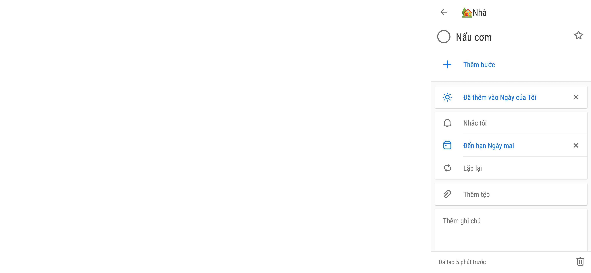

| # | Thành phần | Loại | Chức năng | Dữ liệu |
| ---- | ---------- | ------------------- | --------- | --------- |
| 1 | Nút back| Button | Trở lại màn hình home Icon: https://fonts.google.com/icons?selected=Material%20Icons%3Aarrow_back |  |
| 2 | Icon của Category | ImageView | Hiển thị icon của Category Icon: https://fonts.google.com/icons?selected=Material%20Icons%3Ahome |select(cat#icon)|
| 3 | Tên của Category | TextView | Hiển thị tên của Category |select(cat#name)|
| 4 | Nút hoàn thành | RadioButton | Hiển thị sự hoàn thành của task Icon: https://fonts.google.com/icons?selected=Material%20Icons%3Aradio_button_unchecked |select(task#finished)|
| 5 | Tên task | TextView | Hiển thị tên của task|select(task#name)|
| 6 | Nút quan trọng | ImageView | Hiển thị độ quan trọng của task Icon: https://fonts.google.com/icons?selected=Material%20Icons%3Aradio_button_unchecked |select(task#important)|
| 7 | Thêm bước | TextView | Thêm bước  Icon: https://fonts.google.com/icons?selected=Material%20Icons%3Aadd|insert(subtask)|
| 8 | Thêm vào ngày của tôi | TextView | Đã thêm vào ngày của tôi  Icon: https://fonts.google.com/icons?selected=Material%20Icons%3Alight_mode |update(task#my_day = true)|
| 9 | Nhắc tôi | TextView | Nhắc tôi  Icon: https://fonts.google.com/icons?selected=Material%20Icons%3Anotifications_none|update(task#reminder)|
| 10 | Nhắc tôi/ Cuối ngày | MeneItem | Nhắc tôi cuối ngày  Icon:https://fonts.google.com/icons?selected=Material%20Icons%3Aupdate |update(task#reminder)
| 11 | Nhắc tôi/ Ngày mai | MeneItem | Nhắc tôi ngày mai  Icon:https://fonts.google.com/icons?selected=Material%20Icons%3Aschedule |update(task#reminder)
| 12 | Nhắc tôi/ Tuần tới | MeneItem | Nhắc tôi tuần tới  Icon: https://fonts.google.com/icons?selected=Material%20Icons%3Aarrow_circle_up|update(task#reminder)
| 13 | Nhắc tôi/ Chọn ngày & giờ | MeneItem | Được tự chọn ngày và giờ  Icon:https://fonts.google.com/icons?selected=Material%20Icons%3Atoday |update(task#reminder)
| 14 | Thêm ngày đến hạn | TextView | Thêm ngày đến hạn  Icon: https://fonts.google.com/icons?selected=Material%20Icons%3Acalendar_today |update(task#deadline)|
| 15 | Thêm ngày đến hạn/ Hôm nay | MenuItem | Thêm ngày đến hạn cho hôm nay  Icon:https://fonts.google.com/icons?selected=Material%20Icons%3Atoday |update(task#deadline)
| 16 | Thêm ngày đến hạn/ Ngày mai | MenuItem | Thêm ngày đến hạn cho ngày mai  Icon:https://fonts.google.com/icons?selected=Material%20Icons%3Aevent_note |update(task#deadline)
| 17 | Thêm ngày đến hạn/ Tuần tới | MenuItem | Thêm ngày đến hạn cho thứ 2 tuần tới  Icon:https://fonts.google.com/icons?selected=Material%20Icons%3Aevent_note |update(task#deadline)
| 18 | Thêm ngày đến hạn/ Chọn ngày | MenuItem | Được tự chọn ngày đến hạn  Icon: https://fonts.google.com/icons?selected=Material%20Icons%3Atoday|update(task#deadline)
| 19 | Lặp lại | TextView | Lặp lại  Icon: https://fonts.google.com/icons?selected=Material%20Icons%3Arepeat |update(task#repeat)|
| 20 | Lặp lại/ Mỗi một ngày | MenuItem | Lặp lại cho mỗi ngày  Icon:https://fonts.google.com/icons?selected=Material%20Icons%3Agrain |update(task#repeat)|
| 21 | Lặp lại/ Mỗi tuần | MenuItem | Lặp lại cho ngày đó vào các tuần sau  Icon: https://fonts.google.com/icons?selected=Material%20Icons%3Adrag_indicator|update(task#repeat)|
| 22 | Lặp lại/ Mỗi tháng | MenuItem | Lặp lại cho ngày đó vào các tháng sau  Icon: https://fonts.google.com/icons?selected=Material%20Icons%3Ablur_on|update(task#repeat)|
| 23 | Lặp lại/ Mỗi năm | MenuItem | Lặp lại cho ngày đó vào các năm sau  Icon:https://fonts.google.com/icons?selected=Material%20Icons%3Aauto_fix_high |update(task#repeat)|
| 24 | Thêm ghi chú | EditText | Thêm ghi chú cho task |update(task#note)|
| 25 | Ngày đã tạo/ Hoàn thành | TextView | Hiển thị ngày đã tạo hoặc đã hoàn thành  |select(task#create_at)|
| 26 | Nút xóa task | ImageView | Xóa task  Icon: https://fonts.google.com/icons?selected=Material%20Icons%3Adelete |delete(task#id)|