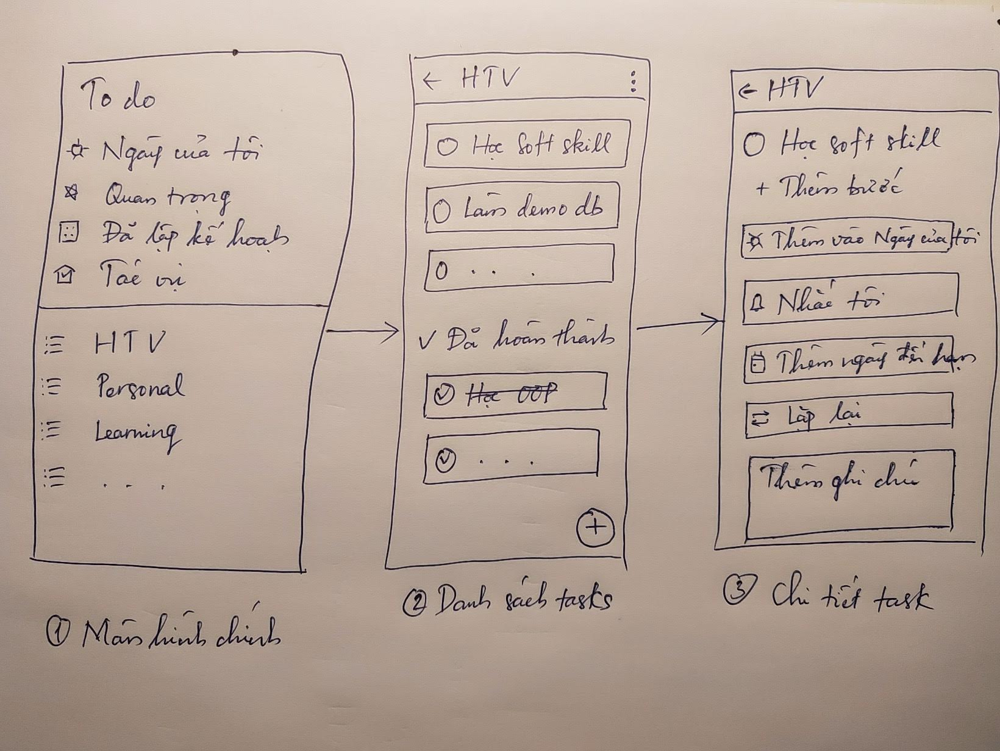

# Tài liệu đặc tả yêu cầu

Cho ứng dụng `To Do`  
Phiên bản: 1.0  
Thực hiện bởi: nhóm Mobile Fresher, bao gồm các thành viên:
* Đào Duy Khởi
* Đỗ Quang Sáng
* Hà Như Bách

Mentor: Đỗ Đình Sĩ  
Hybrid Technologies Viet Nam  
04/2021

## Nội dung

* [Lịch sử sửa đổi](#lịch-sử-sửa-đổi)
* [Giới thiệu](#giới-thiệu)
* [Chức năng](#chức-năng)
* [Giải pháp hệ thống](#giải-pháp-hệ-thống)
* [Yêu cầu kĩ thuật](#yêu-cầu-kĩ-thuật)

## Lịch sử sửa đổi
| Tên | Ngày       | Lý do thay đổi  | Phiên phản   |
| ---- | ---------- | ------------------- | --------- |
| 1.0  | 13/04/2021 | Tạo tài liệu | 1.0       |

## Giới thiệu

Tài liệu này sẽ mô tả tổng quan yêu cầu, danh sách các tính năng, và chi tiết nghiệp vụ các tính năng của hệ thống.

## Chức năng

### Màn hình chính

* Flow chart
* Mô tả tổng quan

### Màn hình danh sách nhiệm vụ

* Flow chart
* Mô tả tổng quan

### Màn hình chi tiết nhiệm vụ

* Flow chart
* Mô tả tổng quan

## Giải pháp hệ thống

Ứng dụng được xây dựng dựa theo mô hình MVVM + Clean Architecture

## Yêu cầu kĩ thuật

### Android

* Ngôn ngữ: `Kotlin`
* Database: `Room (Sqlite)`
* Hỗ trợ phiên bản: `5.0 (api 21)`

### iOS

* Ngôn ngữ: `Swift`
* Database: `Realm`
* Hỗ trợ phiên bản: `13`