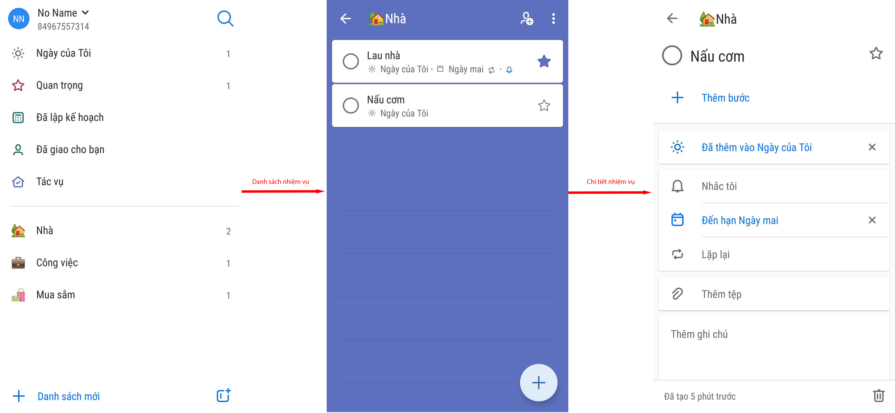

# Tài liệu đặc tả yêu cầu

Cho ứng dụng `To Do`  
Phiên bản: 1.0  
Thực hiện bởi: nhóm Mobile Fresher, bao gồm các thành viên:
* Đào Duy Khởi
* Đỗ Quang Sáng
* Hà Như Bách

Mentor: Đỗ Đình Sĩ  
Hybrid Technologies Viet Nam  
04/2021

## Nội dung

* [Lịch sử sửa đổi](#lịch-sử-sửa-đổi)
* [Giới thiệu](#giới-thiệu)
* [Chức năng](#chức-năng)
* [Giải pháp hệ thống](#giải-pháp-hệ-thống)
* [Yêu cầu kĩ thuật](#yêu-cầu-kĩ-thuật)

## Lịch sử sửa đổi
| Tên | Ngày       | Lý do thay đổi  | Phiên phản   |
| ---- | ---------- | ------------------- | --------- |
| 1.0  | 13/04/2021 | Tạo tài liệu | 1.0       |

## Giới thiệu

Tài liệu này sẽ mô tả tổng quan yêu cầu, danh sách các tính năng, và chi tiết nghiệp vụ các tính năng của hệ thống.

## Chức năng

Flow chart các màn hình của ứng dụng.

### Màn hình chính

Là màn hình hiển thị tổng quan tất cả các nhiệm vụ theo nhóm, và số lượng nhiệm vụ của từng nhóm.

Các nhóm bao gồm:

* Nhóm theo điều kiện:
  * Ngày của tôi
  * Quan trọng
  * Đã lập kế hoạch
  * ~~Đã giao cho bạn~~
  * Tác vụ

* Nhóm do người dùng tạo:
  * Nhà
  * Công việc
  * Mua sắm
  * Trả nợ
  * ...

### Màn hình danh sách nhiệm vụ

Là màn hình hiển thị danh sách các nhiệm vụ của một nhóm. Người dùng có thể sắp sếp thứ tự hiển thị các nhiệm vụ theo các điều kiện khác nhau.

Người dùng có thể:

* Tạo thêm nhiệm vụ cho nhóm này.
* Đánh dấu (hoặc xóa) nhiệm vụ là quan trọng.
* Đánh dấu (hoặc xóa) nhiệm vụ đã hoàn thành.

### Màn hình chi tiết nhiệm vụ

Là màn hình hiển thị chi tiết nhiệm vụ, người dùng có thể chỉnh sửa nội dung của nhiệm vụ tại màn hình này.

Các nội dung có thể chỉnh sửa bao gồm:

* Thêm (hoặc xóa) các nội dung của nhiệm vụ
* Thêm các bước con cho nhiệm vụ
* Xóa nhiệm vụ

## Giải pháp hệ thống

Ứng dụng được xây dựng dựa theo mô hình MVVM + Clean Architecture

## Yêu cầu kĩ thuật

### Android

* Ngôn ngữ: `Kotlin`
* Database: `Room (Sqlite)`
* Hỗ trợ phiên bản: `5.0 (api 21)`

### iOS

* Ngôn ngữ: `Swift`
* Database: `Realm`
* Hỗ trợ phiên bản: `13`