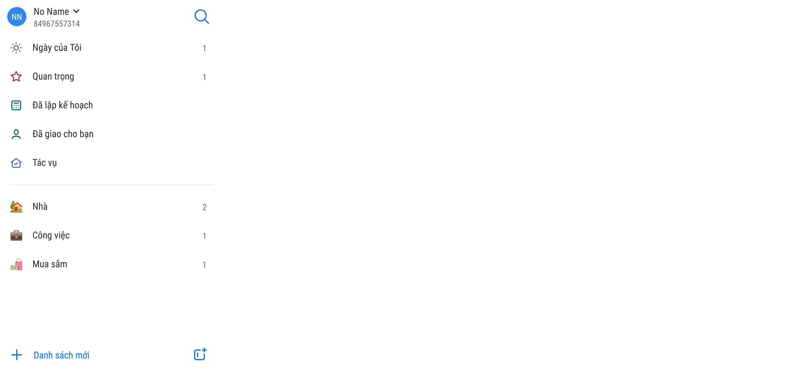

# Ví dụ chi tiết thiết kế

| # | Thành phần | Loại | Chức năng | Dữ liệu |
| ---- | ---------- | ------------------- | --------- | --------- |
| 1 | Ngày của tôi | Nhóm theo thuộc tính | Nhóm các nhiệm vụ được đánh dấu cần quan tâm ngày hôm nay. Icon: abc.png | `count(task#is_my_day = true)` |